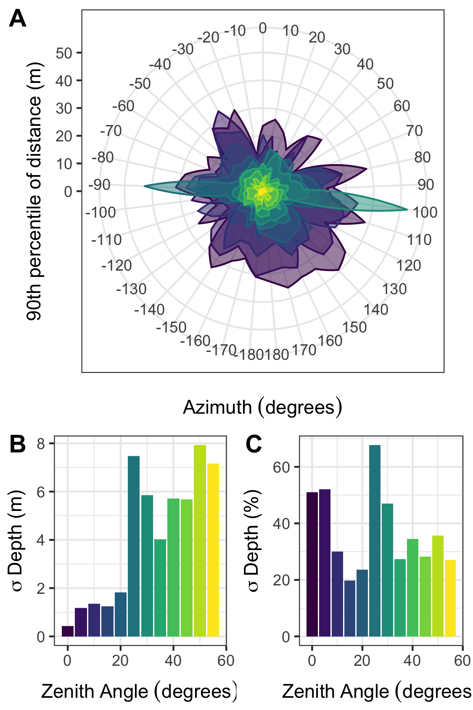

# TLS Depth Complexity

Algorithms described in "Vegetation structural complexity and biodiversity in the Great Smoky Mountains" (Walter et al. 2021; https://onlinelibrary.wiley.com/doi/10.1002/ecs2.3390) for generating a new complexity metric from single-scan terrestrial laser scanning (TLS) data. 

The following algorithm is based in the R programming language.

## Load the Functions

```{r,echo=FALSE}
source("R/depth_FUN.R")
```

## Options
Several parameters are available: 

```{r,echo=FALSE}
zen_bin<-5
zen_range<-c(0,55)
az_bin<-10
percentiles<-c(0.50,0.80,0.90)
```

`zen_bin` is the zenith angle bin size in degrees (default = 5)

`zen_range` is the zenith angle range in degrees (default = `c(0,55)`)

`az_bin` is the azimuth angle bin size in degrees (default = `10`)

`percentiles` are the depth percentiles desired (default = `c(0.50,0.80,0.90)`)
 
Now, the depth function should be properly configured and ready to run!

## RUN THE PIPELINE
Load packages, functions, and input parameters.
```{r,echo=FALSE}
source("R/depth_FUN.R")
```

Load in your TLS file in PTX format (other gridded formats may work, but are untested).
```{r,echo=FALSE}
files<-list.files("input", full.names = TRUE)
df<-read.ptx(files)
```

Run `depth.fun`. The output will be a dataframe of zenith angle bins and complexity metrics described in the publication.
```{r,echo=TRUE}
depth<-depth.fun(df, 
                 zen_bin=5, 
                 zen_range=c(0,55), 
                 az_bin=10, 
                 percentiles=c(0.5,0.80,0.90))
```



